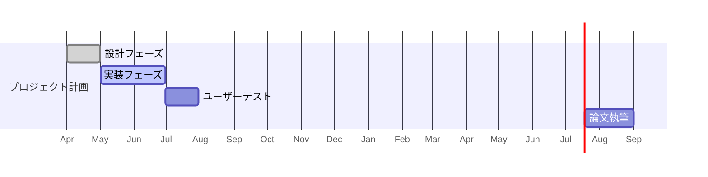

# 🧠 VR_ProjectX ホーム

## 🔍 プロジェクト概要
- **テーマ**：マルチモーダル記憶の宮殿法を活用したVR暗記支援環境の構築
- **目的**：VR/MRを通じて視覚・聴覚・触覚を活用し、認知的負担の少ない暗記支援システムを設計・評価する
- **期間**：2025年4月〜2026年2月
- **担当**：川野輪 裕基（AF19052）

---

## ⛳ ゴール（マイルストーン）
- [ ] 06月末：プロトタイプ完成
- [ ] 07月中：予備実験と中間発表
- [ ] 09月末：本実験実施
- [ ] 12月：卒論執筆完了
- [ ] 02月：発表資料完成

---

## 📁 カテゴリリンク集
- 📐 [[1_設計]]
- 🧪 [[3_実験]]
- 🛠 [[2_実装メモ]]
- 📄 [[4_執筆/研究計画]]
- 📚 [[6_関連研究/literature_index]]
- 📈 [[5_進捗報告/進捗_index]]
- 🗂 [[obsidian構成メモ]]

---

## ✅ 未完了タスク一覧（期限あり）
```tasks
not done
path includes "VR_ProjectX"
due after date(2025-01-01)
sort due ascending
```

🕓 最近更新されたノート（最新5件）
```dataview
list
from #ProjectX
sort file.mtime desc
limit 5
```

🗂 タグ別ノート集約
```dataview
table file.link as "ノート", tags
from #ProjectX
group by tags
```

📅 プロジェクトタイムライン（ガントチャート）


## 📋 タスク管理
- 🗃 [[kanban]]（カンバンボードで全体確認）

