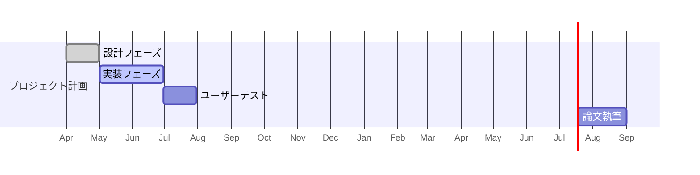

# 🛠 Obsidian構成メモ（VR_ProjectX）

このノートは、本プロジェクトにおける **Obsidian の運用ルール、構成、テンプレート、Dataview 設定** をすべて集約したマニュアルです。

---

## 📁 フォルダ構成（Vault内）
VR_ProjectX/  
├─ 0_Home/ ← ダッシュボード・構成・kanban  
├─ 1_設計/ ← システム設計、UX設計  
├─ 2_実装メモ/ ← Unity/Cursorのコード周辺メモ  
├─ 3_実験/ ← 実験ログ、分析、図表、CSV  
├─ 4_執筆/ ← 研究計画、論文構成案、下書き  
├─ 5_進捗報告/ ← 週次進捗ノート（Wordから転記）  
├─ 6_関連研究/ ← 論文要約、PDF、研究メモ  
├─ Attachments/ ← Word, PDF, 画像等の参照資料  
└─ z_templates/ ← テンプレート集（Templater用）


---

## 🏷 タグ運用ルール

- **基本タグ**：すべてのノートに `#ProjectX` を付与
- **カテゴリタグ**：
  - 設計： `#ProjectX/設計`
  - 実装： `#ProjectX/実装`
  - 実験： `#ProjectX/実験`
  - 執筆： `#ProjectX/執筆`
  - 進捗： `#ProjectX/進捗報告`
  - 研究： `#ProjectX/関連研究`
  - 会議： `#ProjectX/会議`

---

## 🧾 Frontmatter（メタデータ）

```yaml
tags: [#ProjectX/実験]
date: 2025-06-15
status: in-progress
due: 2025-06-30
```

- `status`: idea / in-progress / done / archived
    
- `due`: Dataview や Tasks プラグインで期限管理用

## 🧩 テンプレート一覧（z_templates/`）

|ファイル名|用途|
|---|---|
|`tpl_progress.md`|進捗報告|
|`tpl_experiment.md`|実験ノート|
|`tpl_design.md`|設計メモ|
|`tpl_meeting.md`|会議メモ|
|`tpl_literature.md`|関連研究メモ|

## 🗂 Dataview クエリ例

### ✅ 進捗一覧（`進捗_index.md`）
```dataview
table date as "日付", file.link as "ノート"
from "5_進捗報告"
sort date desc
```

✅ 実験ログ（`experiment_index.md`）
```dataview
table date as "日付", file.link as "ノート", status
from "3_実験"
where file.name != "experiment_index"
sort date desc
```

✅ 関連研究（`literature_index.md`）
```dataview
table citekey as "Key", file.link as "Note", status
from #ProjectX/関連研究
sort status asc
```

## 📋 Kanban 運用

- 保存場所：`0_Home/kanban.md`
    
- プラグイン：**Kanban**
    
- 使用ルール：
    
    - 列：Backlog / ToDo / Doing / Done
        
    - 各カードに `[[ノート名]]` を貼り、関連ノートにジャンプできるように


📅 タイムライン運用（`index.md` or `Timeline.md`）

## 🧪 実験データ管理ルール

- 各実験は1ノート（`実験ログ_YYYY-MM-DD.md`）
    
- CSVや画像は `analysis/`・`figures/` フォルダに保存
    
- ノートに `![[figures/〇〇.png]]` で画像挿入
    
- 実験前準備メモ：[[実験運用メモ]]

## 📌 運用ルーチン

|項目|タイミング|内容|
|---|---|---|
|進捗報告作成|毎週金曜|テンプレ→Obsidian→提出用Wordへ|
|Kanban整理|毎週月曜|ToDo確認＆更新|
|Timeline更新|月1回 or マイルストーン変更時||
|実験記録|実施直後|`tpl_experiment.md` で新規作成|
|設計・実装・会議メモ|随時|テンプレ使用、リンク付けを忘れずに|
## 🔗 関連ノート

- [[index.md]]
    
- [[kanban]]
    
- [[研究計画]]
    
- [[experiment_index.md]]
    
- [[literature_index.md]]


